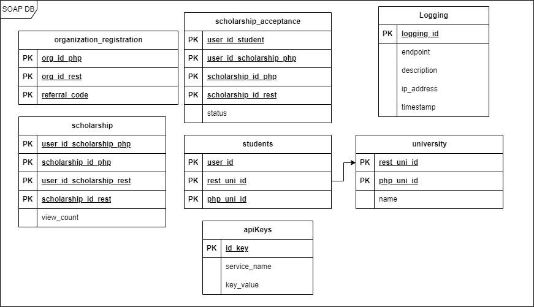

# SOAP Service
SOAP Service for the Scholee Web

Made using Java and Maven

## Prerequisite
Install Maven and a Java SDK, preferably version 8 and above.

## To Run
### Using Maven
In the soap-service, prompt 
```
mvn clean install
mvn exec:java
```

### Using Java
In the soap-service, prompt 
```
mvn clean install
java --add-opens java.base/java.lang=ALL-UNNAMED -jar ./target/SOAP-1.0-SNAPSHOT.jar
```

## Database
The scheme for the SOAP Service is as follows



## API Endpoints
Endpoints are published at localhost:8080/ws/[service name]. API uses POST method using XML Envelopes that will be given below for each services.

### Student Service
#### registerStudent
```
<Envelope xmlns="http://schemas.xmlsoap.org/soap/envelope/">
    <Body>
        <registerStudent xmlns="http://services.soap.orden.com/">
            <user_id xmlns="">1</user_id>
            <rest_uni_id xmlns="">1</rest_uni_id>
            <php_uni_id xmlns="">-1</php_uni_id>
        </registerStudent>
    </Body>
</Envelope>
```

### University Service
#### createUniversity
```
<Envelope xmlns="http://schemas.xmlsoap.org/soap/envelope/">
    <Body>
        <createUniversity xmlns="http://services.soap.orden.com/">
            <rest_uni_id xmlns="">1</rest_uni_id>
            <university_name xmlns="">ITB</university_name>
        </createUniversity>
    </Body>
</Envelope>
```

#### setPHPId
Set the University ID on Monolith App
```
<Envelope xmlns="http://schemas.xmlsoap.org/soap/envelope/">
    <Body>
        <setPHPId xmlns="http://services.soap.orden.com/">
            <php_uni_id xmlns="">1</php_uni_id>
            <rest_uni_id xmlns="">2</rest_uni_id>
        </setPHPId>
    </Body>
</Envelope>
```

#### getAllUniversities
```
<Envelope xmlns="http://schemas.xmlsoap.org/soap/envelope/">
    <Body>
        <getAllUniversities xmlns="http://services.soap.orden.com/"/>
    </Body>
</Envelope>
```

### Organization Registration
#### registerOrganization
```
<Envelope xmlns="http://schemas.xmlsoap.org/soap/envelope/">
    <Body>
        <registerOrganization xmlns="http://services.soap.orden.com/">
            <org_id_php xmlns="">1</org_id_php>
        </registerOrganization>
    </Body>
</Envelope>
```

#### createRESTId
```
<Envelope xmlns="http://schemas.xmlsoap.org/soap/envelope/">
    <Body>
        <registerOrganization xmlns="http://services.soap.orden.com/">
            <org_id_php xmlns="">1</org_id_php>
        </registerOrganization>
    </Body>
</Envelope>
```

#### validateReferralCode
```
<Envelope xmlns="http://schemas.xmlsoap.org/soap/envelope/">
    <Body>
        <validateReferralCode xmlns="http://services.soap.orden.com/">
            <referral_code xmlns="">abcdefgh</referral_code>
        </validateReferralCode>
    </Body>
</Envelope>
```

### Scholarship Service
#### registerScholarship
```
<Envelope xmlns="http://schemas.xmlsoap.org/soap/envelope/">
    <Body>
        <registerScholarship xmlns="http://services.soap.orden.com/">
            <user_id_scholarship_php xmlns="">[int]</user_id_scholarship_php>
            <scholarship_id_php xmlns="">[int]</scholarship_id_php>
        </registerScholarship>
    </Body>
</Envelope>
```

#### getAllScholarship
```
<Envelope xmlns="http://schemas.xmlsoap.org/soap/envelope/">
    <Body>
        <getAllScholarship xmlns="http://services.soap.orden.com/"/>
    </Body>
</Envelope>
```

#### addScholarshipView
Add scholarship view count
```
<Envelope xmlns="http://schemas.xmlsoap.org/soap/envelope/">
    <Body>
        <addScholarshipView xmlns="http://services.soap.orden.com/">
            <user_id_scholarship_php xmlns="">[int]</user_id_scholarship_php>
            <scholarship_id_php xmlns="">[int]</scholarship_id_php>
        </addScholarshipView>
    </Body>
</Envelope>
```

#### getScholarshipView
Get scholarship view count
```
<Envelope xmlns="http://schemas.xmlsoap.org/soap/envelope/">
    <Body>
        <getScholarshipView xmlns="http://services.soap.orden.com/">
            <user_id_scholarship_rest xmlns="">[int]</user_id_scholarship_rest>
        </getScholarshipView>
    </Body>
</Envelope>
```

#### setRESTScholarshipID
Set the rest scholarship id
```
<Envelope xmlns="http://schemas.xmlsoap.org/soap/envelope/">
    <Body>
        <setRESTscholarshipID xmlns="http://services.soap.orden.com/">
            <user_id_scholarship_php xmlns="">[int]</user_id_scholarship_php>
            <scholarship_id_php xmlns="">[int]</scholarship_id_php>
            <user_id_scholarship_rest xmlns="">[int]</user_id_scholarship_rest>
            <scholarship_id_rest xmlns="">[int]</scholarship_id_rest>
        </setRESTscholarshipID>
    </Body>
</Envelope>
```

### Scholarship Acceptance Service
#### getAcceptanceStatus
```
<Envelope xmlns="http://schemas.xmlsoap.org/soap/envelope/">
    <Body>
        <getAcceptanceStatus xmlns="http://services.soap.orden.com/">
            <user_id_student xmlns="">[int]</user_id_student>
        </getAcceptanceStatus>
    </Body>
</Envelope>
```

#### getAllScholarshipAcceptance
```
<Envelope xmlns="http://schemas.xmlsoap.org/soap/envelope/">
    <Body>
        <getAllScholarshipAcceptance xmlns="http://services.soap.orden.com/"/>
    </Body>
</Envelope>
```

#### getStudentOfScholarship
```
<Envelope xmlns="http://schemas.xmlsoap.org/soap/envelope/">
    <Body>
        <getStudentOfScholarship xmlns="http://services.soap.orden.com/">
            <scholarship_id_rest xmlns="">[int]</scholarship_id_rest>
        </getStudentOfScholarship>
    </Body>
</Envelope>
```

#### getUserInfo
```
<Envelope xmlns="http://schemas.xmlsoap.org/soap/envelope/">
    <Body>
        <getUserInfo xmlns="http://services.soap.orden.com/">
            <user_id_student xmlns="">[int]</user_id_student>
        </getUserInfo>
    </Body>
</Envelope>
```

#### registerScholarshipApplication
```
<Envelope xmlns="http://schemas.xmlsoap.org/soap/envelope/">
    <Body>
        <registerScholarshipApplication xmlns="http://services.soap.orden.com/">
            <user_id_student xmlns="">[int]</user_id_student>
            <user_id_scholarship xmlns="">[int]</user_id_scholarship>
            <scholarship_id xmlns="">[int]</scholarship_id>
        </registerScholarshipApplication>
    </Body>
</Envelope>
```

#### setAcceptance
```
<Envelope xmlns="http://schemas.xmlsoap.org/soap/envelope/">
    <Body>
        <setAcceptance xmlns="http://services.soap.orden.com/">
            <user_id_student xmlns="">[int]</user_id_student>
            <scholarship_id_rest xmlns="">[int]</scholarship_id_rest>
            <scholarship_name xmlns="">[string?]</scholarship_name>
            <status xmlns="">[string?]</status>
        </setAcceptance>
    </Body>
</Envelope>
```

#### setScholarshipIDREST
Set the scholarship ID in the REST
```
<Envelope xmlns="http://schemas.xmlsoap.org/soap/envelope/">
    <Body>
        <setScholarshipIDREST xmlns="http://services.soap.orden.com/">
            <user_id_scholarship_php xmlns="">[int]</user_id_scholarship_php>
            <scholarship_id_php xmlns="">[int]</scholarship_id_php>
            <scholarship_id_rest xmlns="">[int]</scholarship_id_rest>
        </setScholarshipIDREST>
    </Body>
</Envelope>
```

## Contributors
| Services/Functionality | 13521004 | 13521007 | 13521024 |
| ------------- | :--------: | :--------: | :--------: |
| SOAP Setup    |          | &check;  |          |
| Models        | &check;  | &check;  |   &check;       |
| Logging       |          | &check;  |          |
| Scholarship Acceptance Service | &check;| &check; | &check; |
| Univeristy Service |     |   &check;| &check; |
| Scholarship Service |    | &check; |           |
| Organization Registration Service |  | &check; | |
| Student Service | &check; | | |
| Java Mail     |          |          |&check;   |